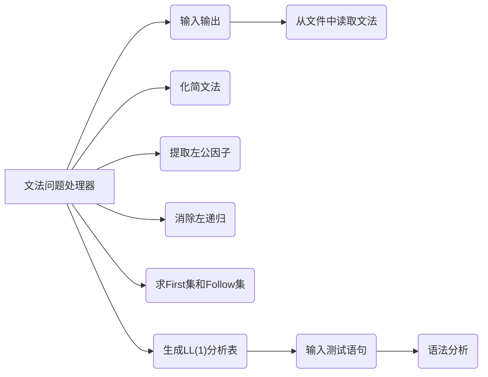
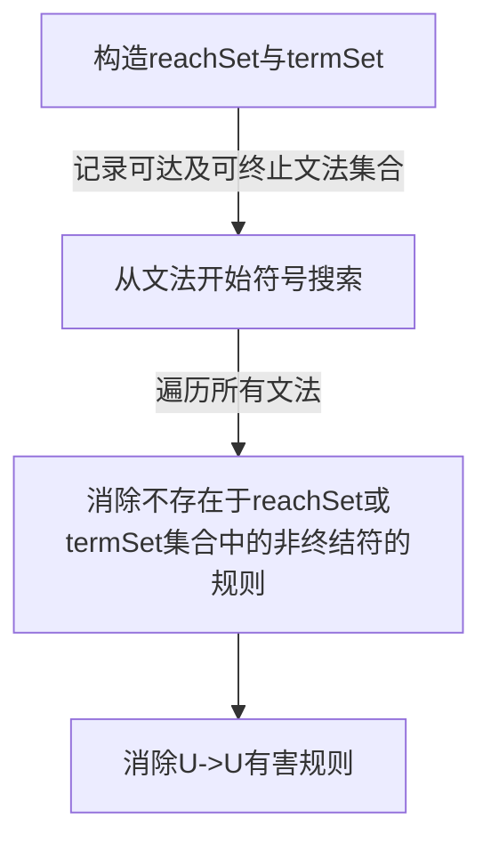
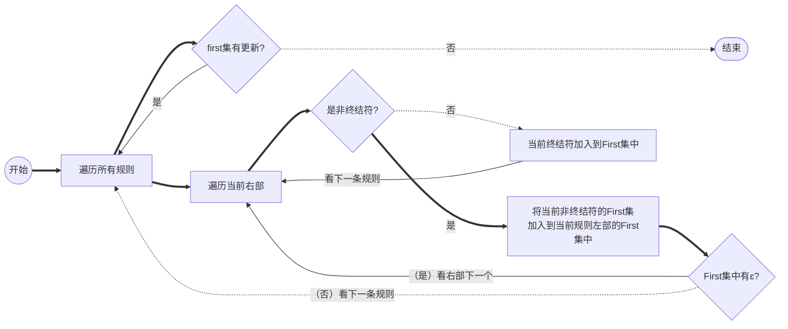
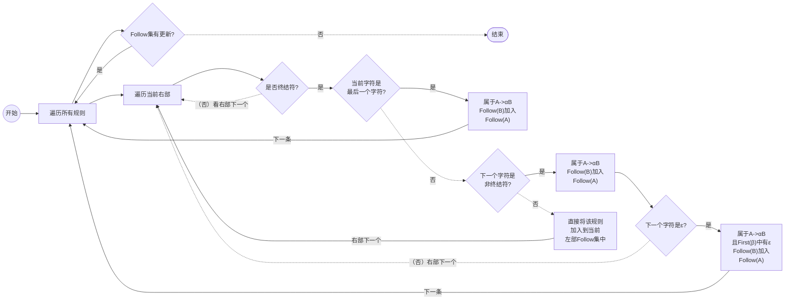

# Compile-Principle-Course

# Task 2 (TINY’s) BNF Grammar Problem Processor

   The system requires an interface that allows the user to open a text file of all the BNF grammars of a language， simplify the grammar， eliminate the left common factor and left recursion， solve the First set and Follow set for each non-terminal symbol， and construct the LL(1) analysis table and present the results of all steps in a window. The LL(1) syntax analysis method is used to carry out the syntax analysis and generate the corresponding syntax tree， the structure of which can be defined for each statement as required. (The syntax tree needs to be presented in a tree-like form).

​      以文本文件的方式输入某一高级程序设计语言的所有语法对应的 BNF 文法，因此系统需要提供一个操作界面，让用户打开某一语言的所有语法对应的 BNF 文法的文本文件，依次化简文法、消除左公共因子以及左递归、求解每一个非终结符号的First集合和Follow集合，并构造出LL（1）分析表，并将所有步骤的结果用窗口展示。采用 LL(1)语法分析方法进行语法分析并生成相应的语法树，每个语句的语法树结构可根据实际的需要进行定义。 （语法树需要采用树状形式进行呈现）。

## 项目设计

### 功能结构图

## 项目实现

### 文法的存储

​      由于该项目的中会用到大量的根据规则左部非终结符寻找对应右部的操作，所以这个操作的时间复杂度应该尽可能小，于是将文法的存储结构设计为QMap<QString， QList<QStringList>>，即终结符→[右部1（候选式QStringList），右部2（候选式QStringList），...]的形式。同时，为了方便后续的操作，还应该设计两个集合，分别存储所有的左部和所有出现过的非终结符。这样就能不遍历所有语法快速拿到所有左部，并且方便地生成一个没出现过的非终结符。当然，文法的开始符号也要拿一个QString类型变量存下来。

本项目中默认输入的第一个规则的左部的符号为文法的开始符号，对于输入的处理首先要将输入中每行前后的空白去掉，并且输入中的空格也应该清除。为了方便处理，非终结符的判断。处理完空白和空格之后，首先应该存储左部，将左部存储到左部集合里和非终结符里即可。然后再开一个循环，通过“->”分词截取出右部。对于右部，首先根据“|”分割右部，并且还要将右部出现的非终结符加入到非终结符集合中去。右部在根据“|”分割之后就可以一条条进行grammars[左部]. (右部)push_back(候选式)，完成存储。

步骤图解：

### 文法化简

​      化简文法需要化简掉两种文法，有害文法U->U和多余规则(不可到达、不可终止)。

#### 有害文法的清除

​      在处理多余规则的时候就可以顺带清除。

#### 多余规则的清除

这里面我们分为几步：首先先构造可达不可终止（reachNoEndSet，简写rNE）与可达可终止（reachEndSet，简写rE）两个集合，然后通过这个来记录可达且可终止的非终结符。首先将开始符号放入可达不可终止集合中，然后设置一个变化标志chengedFlag（产生式是否变化），进入while循环，先从可达不可终止集合rNE中的符号（记为cur）开始，遍历其对应的右部，对于右部的候选式R中的每一个单词（终结符/非终结符）r，我们观察r是否满足 在非终结符集中且不在可达可终止集合中（即该非终结符是否不是可达可终止），若满足该条件则将r加入这个可达不可终止集合rNE中，然后标志位改变。若一轮循环下来该候选式R中所有符号r都可达可终止，则将其左部非终结符cur移至可达可终止rE集合中。

上面的判断结束后，接下来我们需要将这些不可达、不可终止的非终结符（包括其候选式）剔除掉。首先将原来的非终结符做一份拷贝tNT，用作判断，判断可达可终止集合是否与上面的得到的rE集合相同。若不相同，则说明我们需要，删除部分不可终止或不可达的非终结符。首先将移除tNT-rE集合得到的非终结符，以及其所带的产生式。因为这些被删除的符号仍然有可能出现在可达可终止的非终结符的右部候选式中，所以我们还要继续对这边的候选式进行检查，遍历可达可终止非终结符的候选式，检查是否有这样的问题候选式，有的话，我们将它们删除。遍历删除完毕之后，该算法终止。

最后还要扫描遍文法，将“X->@x1…xn”这样的情况中的@去掉。

### 消除左递归

​      做完文法化简工作后，我们进行文法左递归的消除。由易到难，我们首先将直接左递归消除，其算法上相对简单。我们遍历所有非终结符，首先将它们当前的值暂存起来，然后对其进行左递归的消除工作，另外，我们还需要使用一个暂存集合来暂存“处理干净”的非终结符（即没有带左递归的）。直接左递归的处理主要是将形如A->Aα|β变为A->βA'和A'->αA'|ε，现在我改写数据结构非终结符以QString形式存储，那么可以直接套用手工做法在申请新的非终结符的时候在其后面加单引号；间接左递归的处理方式主要通过代入进行消除，这里面代入得非终结符需要是之前已经“处理干净”，代入完后我们就可以又变回直接左递归的算法，对其进行左递归的消除。当然，每次代入前，我们应该存下“快照”，以方便恢复，因为会有存在代入后还未能消除左递归的规则。

### 提取左公因子

提取左公因子分为两种情况：直接左公因子提取及间接左公因子提取。其中间接左公因子提取需要用到直接左公因子提取。对于直接左公因子的提取，我们遍历所有文法产生式，寻找左部相同的规则，这些规则右部的相同前缀，之后进行提取。实际实现中，我们不需要所有右部（候选式）都有公共前缀，只要达到有两个以上的右部有公共前缀就可以进行提取；每次提取的公共前缀不一定需要是最长的。

前缀提取的具体算法如下：遍历左部相同的所有规则的右部Ci，若Ci[0]为非终结符，则跳过（直接左公因子的提取，不需要考虑递归问题)；否则，将Ci[0]记录到公共前缀t_curCddPrefix中，并用一个QList<QStringList> t_eCddList存储Ci，之后,遍历剩下的右部寻找其中开头字符与当前t_curCddPrefix相同的右部Ci,并加入到t_eCddList列表中。遍历结束后，检查com的规模，如果大于一，就说明有两个以上的右部有公共前缀，那么可以尝试去让这个前缀变长。从下标i=1开始遍历所有com中的元素的第i个字符,如果com中所有元素的第i个字符都相同，则将它加入到prefix末尾,并让i++,否则只要有一个元素的第i个字符和其它的元素不相同，都应该终止循环。至此，前缀就提取完成了，接下来就要进行左公因子的提取操作。左公因子的提取操作就是A->αβ|αγ变为A->αA'和A'->β|γ，这就是一些字符串处理的操作，不再赘述，要注意的就是有些右部完全就是前缀的不应该生成提取后剩下的部分。

处理完一条产生式后，我们要决定下一次提取的规则是哪一个。如果这次提取提取出了左公因子，那么还要对它进行提取，反之，如果这次提取没有提取出左公因子，下次提取应该去看下一个规则。

### 计算First集与Follow集

#### First集

对于某个非终结符X的规则X->Y1Y2...Yk

1. 如果Y1是终结符或ε，可以直接将它加入到First集中，之后便可以看下一条规则。
2. 如果Y1是非终结符，则要将Y1的First集加入到X的First集中，并且若Y1的First集中包含ε，则可以去看Y2并根据Y2的类型选择①或②操作进行计算。

当我们遍历完所有规则后，一轮求解就结束了。我们可以发现某个规则X的First集会依赖于其它规则的First集，也就是说，某一个规则的First集若更新了，其他规则的First集就有可能更新，所以，只要某一轮求解结束后，有First集发生了更新，就应该再进行一轮求解，直至没有First集发生更新为止。

#### Follow集

接下来是Follow集的求解。注意Follow集的求解依赖于First集，所以一定要在First集求解完成后才去求解Follow集。Follow集的求解主要依据两个定义：

- 对于规则A->αBβ，First(β)中除ε之外的所有符号都在Follow(B)中。

- 对于规则A->αB 或 A->αBβ且First(β)中有ε，则Follow(A)中所有符号都在Follow(B)中。

  遍历所有规则并且检查是否有符合定义的情况，并根据定义更新Follow集。同样的，我们可以发现某个Follow集会依赖于其他规则的Follow集，所以也应该像求解First集时一样，不断求解直到没有Follow集发生更新为止
  
  

### 构造LL(1)分析表

LL(1)分析表的存储结构

为每个非终结符$$A$$和产生式$A\to\alpha$重复一下两个步骤：

- 对于First(ɑ)中每个几号a，都将$A\to\alpha$添加到项目M[A， a]中
- 若ɛ在First(ɑ)中，则对于Follow(A)的每个元素a（记号或是\$），都将$A\to\alpha$添加到M[A， a]中

### 分析语法（根据LL(1)语法分析方法）

我们可以通过LL(1)分析表对输入的源程序进行语法分析，然后生成分析树，再通过分析树转换成语法树。这个语法树我这里选择面向文法用例实现，即面向通过本程序化简并消除左递归、左公因子的文法，在语法分析生成语法树后，我们再针对该特判转换成语法树。

任务要求我们使用LL1表进行分析，其分析过程如下，我们进行初始化，开两个栈，一个存非终结符（parsing stack），另外一个存token（或者直接使用下标扫描解码的源程序token串）。

进入while循环，若两栈栈顶非结束符“\$”，则继续循环，若p栈顶为终结符且与下一个token相等则p栈顶出栈，接受下一个token；或若p栈顶为非终结符，下一个token为终结符且M[A,a]表不为空，则将其中的产生式逆序压入p栈中；若非这些情况则出错。跳出循环之后，若俩栈顶都为结束符“\$”，则语法正确，否则出错。

这里面有些细节我们要注意，其一是对token的处理，我选择使用空格分词，存为QList<QString>，然后一个个扫描。对于数字、标识符之类的，我们在解码源程序生成token的时候保留其前缀（如ID、NUM），然后识别的时候使用这个前缀识别，而跳过本身的值（也可以存起来，进行下一步生成的准备工作）；另外是对于不同的语言，非终结符的定义都有所不同，因此我们需要在语法分析前对不同语言一特例进行特判，比如TINY和MiniC中的标识符和数字两个名称有所区别，这里我们在解码的和LL1分析扫描token的时候需要进行特判。

