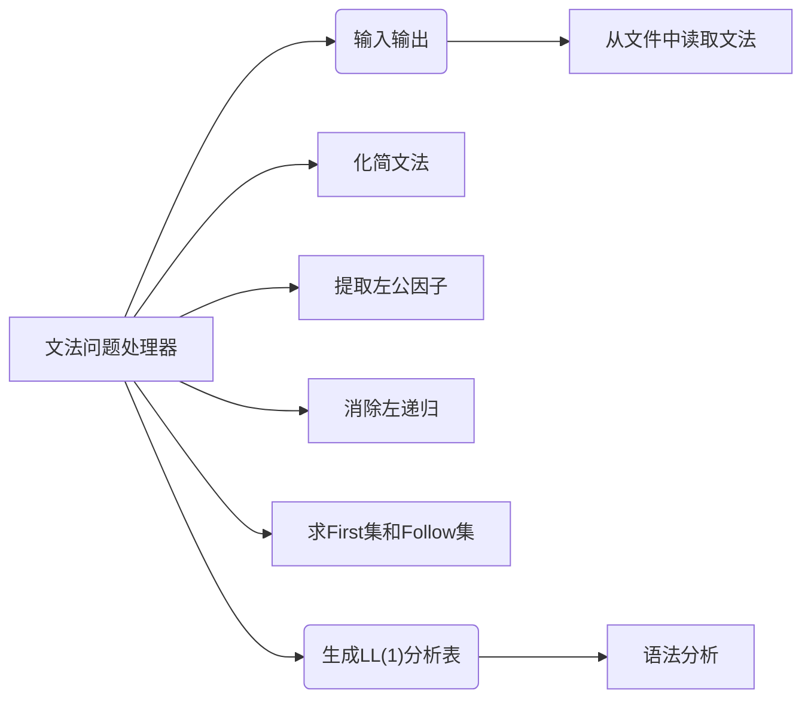

# Compile-Principle-Course

# Task 2 (TINY’s) BNF Grammar Problem Processor

   The system requires an interface that allows the user to open a text file of all the BNF grammars of a language, simplify the grammar, eliminate the left common factor and left recursion, solve the First set and Follow set for each non-terminal symbol, and construct the LL(1) analysis table and present the results of all steps in a window. The LL(1) syntax analysis method is used to carry out the syntax analysis and generate the corresponding syntax tree, the structure of which can be defined for each statement as required. (The syntax tree needs to be presented in a tree-like form).

​      以文本文件的方式输入某一高级程序设计语言的所有语法对应的 BNF 文法，因此系统需要提供一个操作界面，让用户打开某一语言的所有语法对应的 BNF 文法的文本文件，依次化简文法、消除左公共因子以及左递归、求解每一个非终结符号的First集合和Follow集合，并构造出LL（1）分析表，并将所有步骤的结果用窗口展示。采用 LL(1)语法分析方法进行语法分析并生成相应的语法树，每个语句的语法树结构可根据实际的需要进行定义。 （语法树需要采用树状形式进行呈现）。

## 项目设计

### 功能结构图

## 项目实现

### 文法的存储

​      由于该项目的中会用到大量的根据规则左部非终结符寻找对应右部的操作，所以这个操作的时间复杂度应该尽可能小，于是将文法的存储结构设计为QMap<QString, QList<QString>>，即终结符→[右部1,右部2,...]的形式，这样通过一个哈希表存储左部和右部的映射关系，使得通过左部查询右部的平均时间复杂度达到$O(1)$。同时，为了方便后续的操作，还应该设计两个集合，分别存储所有的左部和所有出现过的非终结符。这样就能不遍历所有语法快速拿到所有左部，并且方便地生成一个没出现过的非终结符。当然，文法的开始符号也要拿一个char类型变量存下来。本项目中默认输入的第一个规则的左部的符号为文法的开始符号对于输入的处理首先要将输入中每行前后的空白去掉，并且输入中的空格也应该清除,方便处理的时候下标的计算。处理完空白和空格之后，首先应该存储左部，将左部存储到左部集合里和非终结符里即可。截取掉左部一个字符加中间的->一共3个字符后剩下的子串就是右部，对于右部则要干两件事，根据|分割右部，并且还要将右部出现的非终结符加入到非终结符集合中去。右部在根据|分割之后就可以一条条进行grammars[左部].push_back(右部),完成存储。

步骤图解：

### 文法化简

​      化简文法需要化简掉两种文法，有害文法U->U和多余规则(不可到达、不可终止)。

#### 有害文法的清除

​      在处理多余规则的时候就可以顺带清除。

#### 多余规则的清除

首先明确三个操作：1.搜索的具体操作就是遍历以当前字符为左部的所有规则，如果搜索到某个规则时，发现该规则右部全都是终结符，则说明该规则可以终止，搜索回溯时应该返回当前规则是否可终止。2.判断右部是否全是终结符，应该对右部的终结符进行计数，并于右部的总字符数进行比较。3.对于一个规则的右部而言，如果一个非终结符是可终止的，它也应该被当作一个终结符来看待，即对右部终结符进行计数时应该将可终止的非终结符也加上。接下来是整个算法的执行流程，首先开出两个集合reach和term，分别记录搜索到达的文法和可终止的文法。并且，注意reach和term还可以帮助搜索进行记忆化优化，即如果某个非终结符已经知道它可终结或已经到达过，就不需要再进去搜索了，相当于将搜索变为记忆化搜索，避免了重复计算并优化了递归深度。初始化完这两个集合后，就可以从文法的开始符号，开始进行搜索，注意此时要将开始符号加入到reach中,搜索完毕后还要根据返回值判断文法的开始符号是否加入term中，就对所有文法进行遍历，消除其中存在不在reach或term集合中的非终结符的规则。在遍历时顺便检查是否存在U->U的有害规则，进行消除。

### 消除左递归

左递归包括直接左递归和间接左递归，消除间接左递归中会用到消除直接左递归的操作，所以先思考消除直接左递归的实现。直接左递归的消除根据ppt上的算法进行即可，即A->Aα|β 变为 A->βA'和A'->αA'|ε,这主要是一些字符串的操作，主要考验编码能力，不涉及思路，不再赘述。对于间接左递归，我们需要进行代入来消除，但是代入时要注意，应该是之前已经处理干净的非终结符，才能放心地交给后面进行代入，代入完成后，调用消除直接左递归的算法即可。最后，还应该注意一点，我们在消除左递归的时候，会进行代入，这对于代入后能进行消除左递归的规则当然没问题，但是，对于代入后不能消除的规则就不太好了。虽然代入后它们其实还是一样的规则，但是这些规则的显示就不能保持用户输入的样子了，这其实是不太好的一件事情，虽然说这个程序也许没有用户会使用，不用去考虑用户体验，但是即便仅仅是对于我们自己debug来说，如果规则较为复杂，这个代入就会让debug的难度增加，因为有些并没有被消除左递归的规则变了样子，而这还需要我们观察才能发现它们变样只是因为进行了代入。所以，应该在代入之前存下规则的原样和一开始就有的左部。并设置消除直接左递归的函数返回是否有消除，这样，对于代入后未进行消除左递归，并且左部的是一开始就有的的规则，我们将它还原代入，将它们变回带入前的样子。

### 提取左公因子

对于左公因子的提取，有间接的左公因子和直接的左公因子两种。消除间接左公因子时要用到提取左公因子，所以先对直接左公因子进行提取。对于直接左公因子的提取，我们遍历所有文法，寻找左部相同的规则的右部的相同前缀，之后进行提取。在这里相同前缀的查找和一些经典的字符串算法有些不同，体现在 ①不需要所有右部都有公共前缀，其中有两个以上的右部有公共前缀就可以进行提取 ②许多经典算法一般是寻找最长公共前缀，但这里，为了算法更加简洁，每次提取的公共前缀不需要是最长的。

前缀提取的具体算法如下：遍历左部相同的所有规则的右部Ri，若Ri[0]为非终结符,则跳过(因为此时进行的时直接左公因子的提取，不需要去考虑递归)，否则，将Ri[0]记录到公共前缀prefix中，并用com数组存储Ri，之后,遍历剩下的右部寻找其中开头字符与当前prefix相同的右部Ri,并加入到com数组中。遍历结束后，检查com的规模，如果大于一，就说明有两个以上的右部有公共前缀，那么可以尝试去让这个前缀变长。从下标i=1开始遍历所有com中的元素的第i个字符,如果com中所有元素的第i个字符都相同，则将它加入到prefix末尾,并让i++,否则只要有一个元素的第i个字符和其它的元素不相同，都应该终止循环。至此，前缀就提取完成了，接下来就要进行左公因子的提取操作。左公因子的提取操作就是A->αβ|αγ变为A->αA'和A'->β|γ，这就是一些字符串处理的操作，不再赘述，要注意的就是有些右部完全就是前缀的不应该生成提取后剩下的部分。
之后，我们要决定下一次提取的规则是哪一个。如果这次提取提取出了左公因子，那么它就还有可能有左公因子可供提取，所以还要对它进行提取，反之，如果这次提取没有提取出左公因子，那么再去提取也肯定提取不到，所以下次提取应该去看下一个规则对于间接左公因子的的提取，首先先做一次直接左公因子的提取，之后进行是处理类似间接左递归时候的代入操作，但是对于间接左公因子，这个问题会复杂一点，因为可能会出现需要非常多次代入才能提取结束甚至根本无法提取结束的情况，我们就要人为地限制于一下递归层数，按照实验要求所说就是限制到4层递归，由于实验要求中将未代入就进行一次直接左公因子提取认为是第一层递归，所以实际上要限制代入次数最大为3次，注意这里对代入次数的计数，应该是对某一轮是否发生代入进行计数，否则若一个规则的右部发生了多次代入，就会被计为多次代入，得不到想要的效果。每一轮代入完毕之后，都要进行一次直接左公因子的提取，之后判断下当前代入的次数，如果已经大于3，就应该结束代入。在返回值处，将代入次数与3的比较返回，以标志是否发生了递归层数过深的情况。注意为了保证执行次数足够,应该在代入之外加上一层循环3次的循环，保证有足够的轮数让过深的递归层数被发现。

### 计算First集与Follow集

对于某个非终结符X的规则X->Y1Y2...Yk,①如果Y1是终结符或ε，可以直接将它加入到first集中，之后便可以看下一条规则。②如果Y1是非终结符，则要将Y1的first集加入到X的first集中，并且若Y1的first集中包含ε，则可以去看Y2并根据Y2的类型选择①或②操作进行计算。当我们遍历完所有规则后一轮求解就结束了，我们可以发现某个规则X的first集会依赖于其它规则的first集，也就是说，某一个规则的first集若更新了，其他规则的first集就有可能更新，所以，只要某一轮求解结束后，有first集发生了更新，就应该在进行一轮求解，直至没有first集发生更新为止。
接下来是follow集的求解。注意follow集的求解依赖于first集，所以一定要在first集求解完成后才去秋姐follow集。follow集的求解主要依据两个定义：①对于规则A->αBβ，first(β)中除ε之外的所有符号都在follow(B)中。②对于规则A->αB 或 A->αBβ且first(β)中有ε，则follow(A)中所有符号都在follow(B)中。遍历所有规则并且检查是否有符合定义的情况，并根据定义更新follow集。同样的，我们可以发现某个follow集会依赖于其他规则的follow集，所以也应该像求解first集时一样，不断求解直到没有follow集发生更新为止

### 构造LL(1)分析表

### 分析语法（根据LL(1)语法分析方法）

