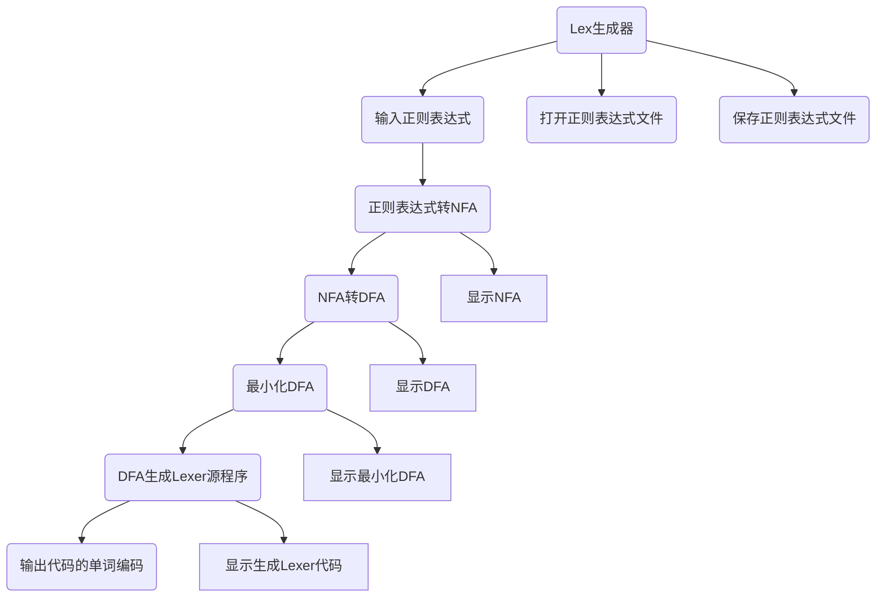
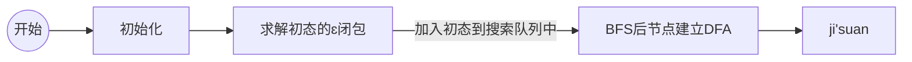
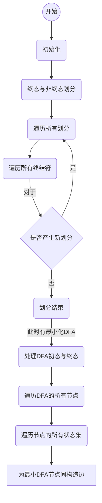

# Compile-Principle-Course


## Task 1 (TINY’s) Regex to Lexer

   The system needs to provide an interface that allows the user to open a text file of all words in a language, convert the resulting lexical analysis program (which needs to be described in C) to compile an executable program from the source program requested above, and test it with a source program in that high-level programming language. A source program in this high-level programming language is tested and the word code of this source program is output. A window needs to be provided so that the user can view the word code.

​        以文本文件的方式输入某一高级程序设计语言的所有单词对应的正则表达式，系统需要提供一个操作界面，让用户打开某一语言的所有单词对应正则表达式文本文件，转换得到的词法分析程序（该分析程序需要用 C 语言描述）对上述要求得到的源程序进行编译生成一个可执行程序，并以该高级程序设计语言的一个源程序进行测试，输出该该源程序的单词编码。需要提供窗口以便用户可以查看该单词编码。


## 项目设计

### 功能结构图




### 正则转NFA

- 连接运算的处理

  > 连接运算在正则表达式中的表示中是不需要字符的，也即是说没有运算符。如果不对这种情况进行处理，则会导致识别转换过程中出现问题：运算符栈没有运算符放入的话，出栈的时候字符栈有些字符就不能够出栈。我们这里使用&字符处理两个相连接的字母。

- Thompson方法将正则表达式转换为NFA：

  > 为每个基本正则表达式构造一个基本的NFA子图，尔后根据正则表达式将各子NFA连接起来

  以下为基本的正则表达式以及其NFA子图：

  - digit/letter/$\epsilon$

    ```mermaid
    flowchart LR
    start-->s((0))--a-->ss(((1)))
    ```

  - 连接

    ```mermaid
    flowchart LR
    subgraph NFA1
    s(( ))-."r".-ss(( ))
    end
    subgraph NFA2
    ss--ɛ-->ss3(( ))
    ss3-."s".-ss4((( )))
    end
    
    ```

  - 选择 |

    ```mermaid
    flowchart LR
    st(( ))--ɛ-->s
    st--ɛ-->ss3
    
    subgraph NFA1
    s(( ))-."r".-ss(( ))
    end
    
    subgraph NFA2
    ss3(( ))-."s".-ss4((( )))
    end
    
    ss4--ɛ-->ss5((( )))
    ss--ɛ-->ss5
    ```

  - 闭包 *

    ```mermaid
    flowchart LR
    st(( ))--ɛ-->s
    
    
    subgraph " "
    ss--ɛ-->s
    s(( ))-."r".-ss(( ))
    end
    
    
    
    ss--ɛ-->ss5((( )))
    st--ɛ-->ss5
    ```

  - 正闭包 +

    ```mermaid
    flowchart LR
    st(( ))--ɛ-->s
    
    
    subgraph " "
    ss--ɛ-->s
    s(( ))-."r".-ss(( ))
    end
    
    
    
    ss--ɛ-->ss5((( )))
    
    ```

    

  - 可选 ?

    ```mermaid
    flowchart LR
    st(( ))--ɛ-->s
    
    subgraph " "
    s(( ))-."r".-ss(( ))
    end
    
    ss--ɛ-->ss5((( )))
    st--ɛ-->ss5
    ```

    

- 运算符优先级处理

  类似于平时的数学运算法则，正则表达式的符号也有结合的优先级


### NFA转DFA


NFA转DFA求解流程如下示：




### 最小化DFA

最小化DFA求解流程



### 由DFA生成Lexer源代码及源程序

