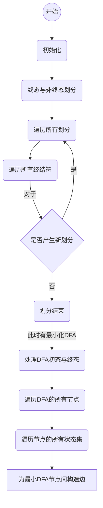

# Compile-Principle-Course

## Task 1

Regex to Scanner

最小化DFA求解流程

```mermaid
flowchart TB
start((开始))-->init(初始化)-->div(终态与非终态划分)-->for(遍历所有划分)-->ffor(遍历所有终结符)--对于-->if{是否产生新划分}
if--是-->for
if--否-->ediv(划分结束)--此时有最小化DFA-->p(处理DFA初态与终态)-->pfor(遍历DFA的所有节点)-->pffor(遍历节点的所有状态集)-->e[为最小DFA节点间构造边]
```

