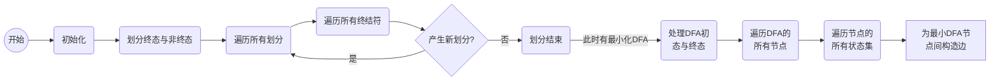

# Compile-Principle-Project


# Task 1 (TINY’s) Regex to Lexer

   The system needs to provide an interface that allows the user to open a text file of all words in a language, convert the resulting lexical analysis program (which needs to be described in C) to compile an executable program from the source program requested above, and test it with a source program in that high-level programming language. A source program in this high-level programming language is tested and the word code of this source program is output. A window needs to be provided so that the user can view the word code.

​        以文本文件的方式输入某一高级程序设计语言的所有单词对应的正则表达式，系统需要提供一个操作界面，让用户打开某一语言的所有单词对应正则表达式文本文件，转换得到的词法分析程序（该分析程序需要用 C 语言描述）对上述要求得到的源程序进行编译生成一个可执行程序，并以该高级程序设计语言的一个源程序进行测试，输出该该源程序的单词编码。需要提供窗口以便用户可以查看该单词编码。


## 项目设计

### 功能结构图


## 项目实现

### 正则转NFA

- 连接运算的处理

  ​      连接运算在正则表达式中的表示中是不需要字符的，也即是说没有运算符。如果不对这种情况进行处理，则会导致识别转换过程中出现问题：运算符栈没有运算符放入的话，出栈的时候字符栈有些字符就不能够出栈。我们这里使用&字符处理两个相连接的字母。

- Thompson方法将正则表达式转换为NFA：

  ​      为每个基本正则表达式构造一个基本的NFA子图，尔后根据正则表达式将各子NFA连接起来

  以下为基本的正则表达式以及其NFA子图：

  - digit/letter/$\epsilon$

    ```mermaid
    flowchart LR
    start-->s((0))--a-->ss(((1)))
    ```

  - 连接

    ```mermaid
    flowchart LR
    subgraph NFA1
    s(( ))-."r".-ss(( ))
    end
    subgraph NFA2
    ss--ɛ-->ss3(( ))
    ss3-."s".-ss4((( )))
    end
    
    ```

  - 选择 |

    ```mermaid
    flowchart LR
    st(( ))--ɛ-->s
    st--ɛ-->ss3
    
    subgraph NFA1
    s(( ))-."r".-ss(( ))
    end
    
    subgraph NFA2
    ss3(( ))-."s".-ss4((( )))
    end
    
    ss4--ɛ-->ss5((( )))
    ss--ɛ-->ss5
    ```

  - 闭包 *

    ```mermaid
    flowchart LR
    st(( ))--ɛ-->s
    
    
    subgraph " "
    ss--ɛ-->s
    s(( ))-."r".-ss(( ))
    end
    
    
    
    ss--ɛ-->ss5((( )))
    st--ɛ-->ss5
    ```

  - 正闭包 +

    ```mermaid
    flowchart LR
    st(( ))--ɛ-->s
    
    
    subgraph " "
    ss--ɛ-->s
    s(( ))-."r".-ss(( ))
    end
    
    
    
    ss--ɛ-->ss5((( )))
    
    ```

    

  - 可选 ?

    ```mermaid
    flowchart LR
    st(( ))--ɛ-->s
    
    subgraph " "
    s(( ))-."r".-ss(( ))
    end
    
    ss--ɛ-->ss5((( )))
    st--ɛ-->ss5
    ```

    

- 运算符优先级处理

  ​      类似于平时的数学运算法则，正则表达式的符号也有结合的优先级，我们将正则表达式转换为NFA的最后一步就要解决该问题。上学期课堂上老师提示过可以通过开两个栈（符号栈、运算符栈）的方法解决该问题，这里我们可以应用该方法，该方法有以下要点：
  
  1. 规定符号优先级
  
     | **优先级（数字越大越低）** | **符号**  | **含义**   | **实际编码（数字越大优先级越高）** |
     | -------------------------- | --------- | ---------- | ---------------------------------- |
     | **1**                      | （Regex） | 正则表达式 | /                                  |
     | **2**                      | * ？+     | 单目运算符 | 3                                  |
     | **3**                      | &         | 连接运算   | 2                                  |
     | **4**                      | \|        | 选择       | 1                                  |
     | **5**                      | （        | 左括号     | 0                                  |
  
  2. 生成NFA规则
  
     扫描正则表达式：
  
     - 遇到字符a：直接生成字符a的NFA并压入字符栈
     - 遇到“(”号：直接压入符号栈
     - 遇到“)”号：需要符号栈一直弹出至“(”，每次弹出一个运算符的同时，从字符
       栈中弹出他需要的个数的NFA，进行运算。当弹出到“(”时，直接丢弃“)”号，进入下一轮判断
     - 遇到“\*”、“?”、“+”号：从字符栈中弹出一个元素A，计算A*/A?/A+后压回字符栈中
     - 遇到“&”号：从字符栈中先后弹出两个元素A、B，计算B&A后压回栈中
     - 遇到“|”号：
       - 若符号栈为空：直接压入符号栈
       - 若符号栈非空：从字符栈中先后弹出两个元素A、B，计算B|A后压回字符栈
  
     结束条件：
  
     - 扫描结束且符号栈为空
  
     字符栈栈顶运算即为最终运算结果。
  
- 需要注意的的是，为了更好地处理细节情况，我们还需要加入一些子函数进行处理。对于上述遇到运算符所进行的操作，我们先大致分为几种操作：遇到操作符、运算符出栈与入栈联动处理、操作符元素连接处理、运算符优先级判断。

  - 遇到操作符的情况，我们先判断是否有转义，然后再生成一个简单的NFA子图入操作符栈；
  - “&”号与“|”号来说，这两种情况我们进入与操作符栈顶元素优先级的判断，判断谁先处理处理；而对于“*+？”这三个符号来说，则在处理完的基础上还要判断是否要对操作符栈中的元素作连接处理；
  - 对于要处理的运算符，我们进入另外一个子函数中进行处理，这个子函数中我们扫描到一个运算符，就对操作符栈中的元素作相应的处理，比如遇到连接符号&就在操作符栈中弹出两个元素出来，将其其中一个的初态与另外一个元素的终态连接，再压回栈中，以此类推。


### NFA转DFA

DFA与NFA的主要区别在于：DFA只有一个初态且遇到一个终结符后只会转移到一个确定的状态。所以，NFA转换为DFA主要解决的问题是：消除导致转移到的状态不确定的ε转换和多重转换。

消除ε转换比较简单，将某状态和其能通过0~n条ε边转换的状态合并为一个状态。完成消除ε转换后，只能有一个初态的问题也同时解决了。求某状态和其能通过0~n条ε边转换的状态，就是求某状态的ε闭包的过程。 

消除多重转换则是将某个状态（集）遇到某个终结符后能转移到的所有状态合并为一个状态即可。即，先找出某状态遇到某终结符后能转移到的状态，再求所有能转移到的状态的ε闭包即可。实现中，先遍历状态集，将状态集中各个状态通过某终结符能转换到的状态放到一个集合中，再将集合拿去上面写好的求ε闭包的函数中求ε闭包即可。这当中遍历顺序我是从初态开始求起，求得DFA初态，然后进栈，遍历操作符集合，后求其遍历从该节点能够通过操作符能够到达的节点的ε闭包，得到的新集合与暂存划分集合判断是否产生了新状态，以此决定是否需要再将新状态进栈，操作符集合遍历完一轮之后，若栈非空，则说明还需要处理，继续下一轮判断。

算法最后，我们还需要找出DFA中的终态，DFA中的终态的求解的原理是：如果DFA中某个状态集包含NFA的终态 则它是DFA中的一个终态。我们只需要遍历DFA结点的状态集,看其中是否有状态在NFA中是终态，如果是，那么该DFA结点是DFA中的终态，我们需要对其做标记。

这里NFA转DFA中DFA的存储结构，对于DFA节点我们需要用一个QSet<QSet<int>>来存储（NFA状态划分），这样我们每次求解ε闭包的时候就可以根据QSet里面的元素来判断是否产生了NFA新的状态集（即DFA状态），若产生了新的状态集，我们则将该状态集加入这个QSet中，并新建DFA状态并存储，且增加当前DFA状态能够通过ch边去到新的DFA状态；若是已存在该DFA状态划分，我们则去扫描已有的DFA节点，修改其出边信息（因为当前DFA状态通过ch边去到的DFA状态发生变更）。新建DFA状态的过程中，判断其是否为DFA终态，若是则加入DFA终态集合，方便后续输出和判断。

NFA转DFA求解流程如下示：


### 最小化DFA

手工做法是先划分初态和终态，再找出相同的状态合并；然而在代码角度用找出不同的状态来划分的角度来处理，代码会更方便些（这样对于终止条件的定义和处理会简单很多）。因为用划分的角度来看的话，从划分终态和非终态开始我们每次做的就是类似的操作。

这里需要注意的是，一开始不要在原集合上划分，而是开一个临时的划分集QSet<int>dividedSet[]去尝试划分，如果确实需要划分才去划分（再开一个临时变量存储划分数，遍历带划分集合中的所有状态，如果待划分集合中的某状态遇到当前划分依据的终结符后转换到一个与之前转换到的状态不同的状态时，划分数就加1。遍历完成后，如果临时变量划分数大于1则说明原本在同一集合中的状态，遇到同一个终结符后，转换成的状态的种类不同（divCount>1），那么真的需要进行划分，这时候将这个暂存划分QSet<int> dividedSet[]的暂存划分stateSet t_stateSet[]放入暂存划分中）。否则如果后来发现不需要划分，再去回溯会比较麻烦。如果一次划分没有产生新划分，那么之后肯定也不会再产生新划分了，此时算法结束。

划分完成后，每一个划分就是最小DFA(mDFA)中的一个结点，我们还需要根据原DFA的信息完善新生成的最小DFA（mDFA）。最小DFA某节点状态集中的状态若包含原DFA的初态/终态，那么它就是最小DFA中的初态/终态。而对于最小DFA中的边，我们需要双层循环遍历各个最小DFA结点的状态集，看它们两两之间在原DFA中的连接情况，进行边的连接。为了求解方便，我们为最小化DFA的划分中划分出来的状态集专门设计一个存储结构（就是上面说到的暂存划分结构QSet<int> dividedSet[]，里面存着该划分的状态集，和它们遇到划分依据的字符后转移到的状态。遍历完成完善边的连接信息之后，我们直接将这些划分数组一个个拷回最小DFA图存储结构中。

最小化DFA求解流程



### 由DFA生成Lexer源代码及源程序

最小化DFA后，我们可以直接利用这个DFA构造词法分析程序的代码。本人生成代码的方式比较朴素，采用字符串拼接的方式进行。首先将词法分析程序的C代码头文件以及一些初始化操作的代码先写好，然后确定好哪些情况是需要用代码循环生成的，然后再去对这一部分程序进行编写。由于前面的正则表达式中数字和字母这两种情况直接各用一个单词替代，所以我们在生成词法分析程序的时候要将它们还原为（a|b|…|Y|Z）和（0|1|…|9）这种情况，这里面我们就另外用一个子函数去处理生成，而对于一般的标识符，我们则选择不编码，这里同样通过上面的子函数进行辨别。分析部分完成之后，我们对部分关键字进行编码，使用一个map及unsigned char进行标记（编码从128开始）。最后将编码输出文件规定好之后我们就完成了对该词法分析程序的代码的编写。编码方面我们还有一点需要注意的是，我们这个编码的源程序文件是要在任务二中进行解码后进行语法分析的，所以相应的编码识别我也规定了一个统一的标准。该标准如下：1. 遇到关键字，关键字事先已经通过unsigned char编码，然后前面再加上“Keyword:”的字样进行标识，如“Keyword:if”；2. 遇到标识符，则保留原样输出，但前面加上字样“ID:”进行标识；3. 数字则同理使用“Digit:”进行标识。
